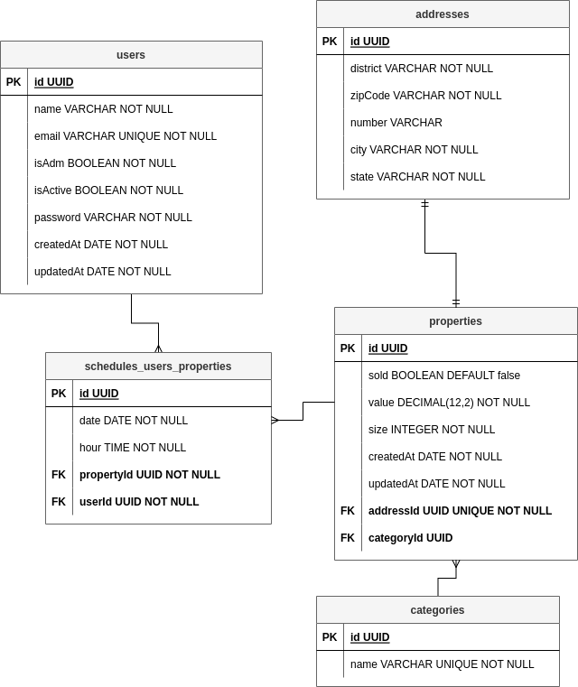

<h1 style="text-align: center" name="KImoveis">KImoveis</h1>

## 1. Contents Table
<hr> 

- [1. Contents Table](#1-contents-table)
- [2. Project objective](#2-project-objective)
- [3. Tecnologies](#3-tecnologies)
- [4. ER diagram](#4-er-diagram)
- [5. Quick start](#5-quick-start)
  - [5.1 Installing dependencies](#51-installing-dependencies)
  - [5.2 Enviroment variables](#52-enviroment-variables)
  - [5.3 Migrations](#53-migrations)
- [6 Endpoints](#6-endpoints)
  - [6.1 Index](#61-index)
  - [6.2 users](#62-users)
    - [routes:](#routes)
    - [User creation:](#user-creation)
 


## 2. Project objective
<hr> 

This project was created with a learning purpose. It is a assignment made for praticing
the creation of an api, database and their connection. The project objective is to create a
back-end service responsible for managing a real state agency.
<br>

base url: [http://localhost:3000](http://localhost:3000)

## 3. Tecnologies
<hr> 


- [node](https://nodejs.org/en/)
- [typescritp](https://www.typescriptlang.org/)
- [express](https://www.npmjs.com/package/express)
- [docker](https://www.docker.com/)
- [bcript](https://www.npmjs.com/package/bcrypt)
- [typeorm](https://typeorm.io/)
- [jsonwebtoken](https://www.npmjs.com/package/jsonwebtoken)
- [express-async-errors](https://www.npmjs.com/package/express-async-errors)
- [postgresql](https://www.postgresql.org/docs/)
 

## 4. ER diagram
<hr> 


 

## 5. Quick start
<hr> 

### 5.1 Installing dependencies

Clone the project and install its dependencies

```bash
yarn
```


### 5.2 Enviroment variables

Copy the .env.example into a file with the name .env and then fill the variables.

```bash
cp .env.example .env
```


### 5.3 Migrations

Run the migrations. They will create the postgres tables into the database.

```bash
run typeorm migration:run -d src/data-source.ts
```
 

## 6 Endpoints
<hr> 

### 6.1 Index
- [index](#61-index)
- [users](#1-users)
 
### 6.2 users

<br>

#### routes:

method | route    |      description
-------|-------   |-------------------
post   |/users    |Creates user
get    |/users    |List all users
get    |/users/:id|List one user by its id

<br>

#### User creation:

POST `/users`

_request:_ 
```javascript
{
	"name": "Fernando",
	"email": "scramignonnarde@gmail.com",
	"isAdm": true,
	"password": "1234"
}
```
_response:_
```shell
201 created
```
```javascript
{
	"name": "Fernando",
	"email": "scramignonnarde@gmail.com",
	"isAdm": true,
	"isActive": true,
	"id": "c19a14a1-3d56-4ca4-8a65-49605212aaf0",
	"createdAt": "2022-08-30T18:56:27.255Z",
	"updatedAt": "2022-08-30T18:56:27.255Z"
}
```

_possible errors:_

error code | description
-----------|-------------
400        |Request has wrong format
400        |Name must be a string
400        |Email must be a string
400        |Password must be a string
400        |User is already registered